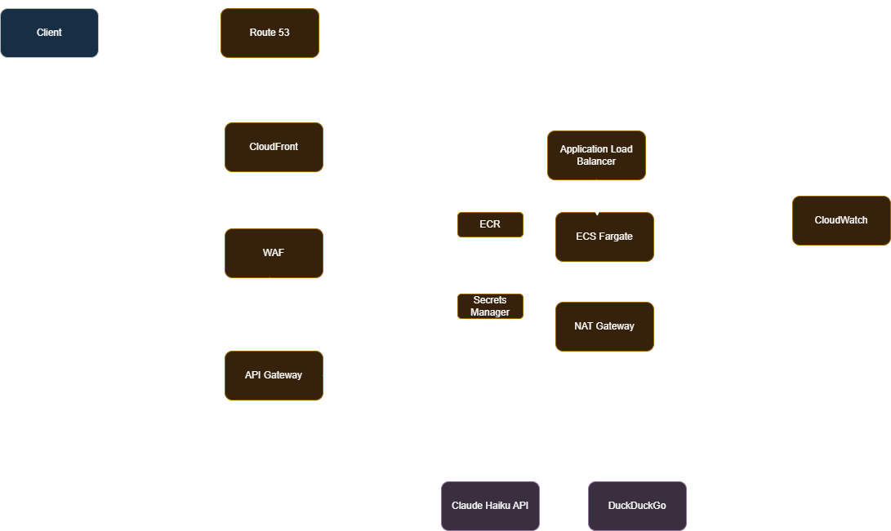

# AWS Deployment Architecture

A production-grade AWS deployment for this service. Traffic flows from the client through a series of security layers before hitting the containerised application, which then contacts out to external APIs through a controlled egress path.

---

## Component Descriptions

| Component | Role |
|---|---|
| **Client** | End user or application calling the API. |
| **Route 53** | AWS managed DNS. Resolves the public domain name and routes traffic to CloudFront. |
| **CloudFront** | Global CDN and edge layer. Eliminates TLS, caches static responses at edge locations, and reduces latency for geographically distributed clients. |
| **WAF** (Web Application Firewall) | Sits in front of the API Gateway. Applies rule sets to block common web exploits (SQLi, XSS, rate abuse) before malicious requests reach the application. |
| **API Gateway** | Managed HTTP/REST gateway. Handles request routing, throttling, authorization, and payload validation before forwarding to the internal load balancer. |
| **Application Load Balancer** | Layer 7 load balancer inside the VPC. Distributes inbound HTTP traffic across ECS Fargate tasks and performs health checks. |
| **ECS Fargate** | Serverless container runtime. Runs the FastAPI/LangGraph application image without requiring management of EC2 instances. Scales tasks horizontally in response to load. |
| **ECR** (Elastic Container Registry) | Private Docker image registry. Stores versioned images of the application; ECS Fargate pulls from here on task start. |
| **Secrets Manager** | Stores sensitive configuration (e.g. `ANTHROPIC_API_KEY`) as encrypted secrets. ECS tasks retrieve them at runtime and consume them as environment variables. |
| **NAT Gateway** | Provides outbound-only internet access for ECS tasks running in private subnets. Required for Fargate tasks to call the Claude Haiku API and DuckDuckGo without being directly reachable from the internet. |
| **CloudWatch** | Offers an observability layer that collects container logs, application metrics, and alarms; used for monitoring, debugging, and alerting. |
| **Claude Haiku API** | External Anthropic LLM endpoint. Called by the router and answer nodes to classify queries and generate responses. |
| **DuckDuckGo** | External search API. Used by the search node to retrieve live financial data, news, and market prices. |
